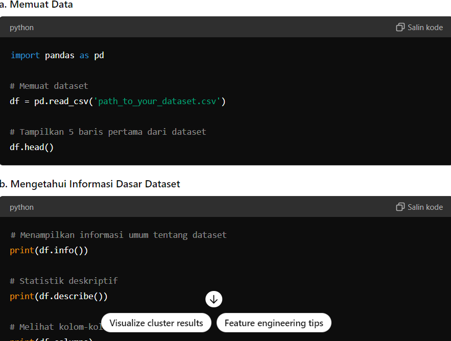
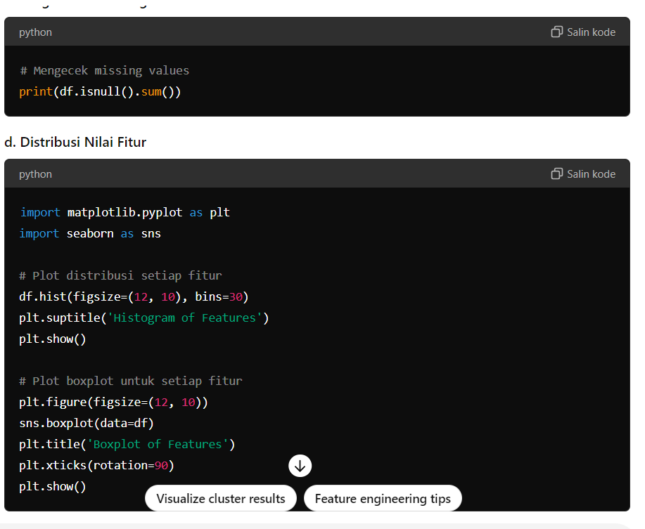
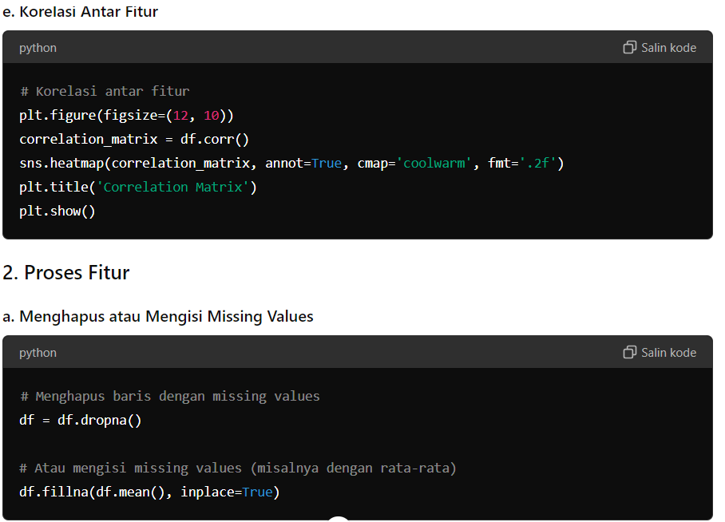
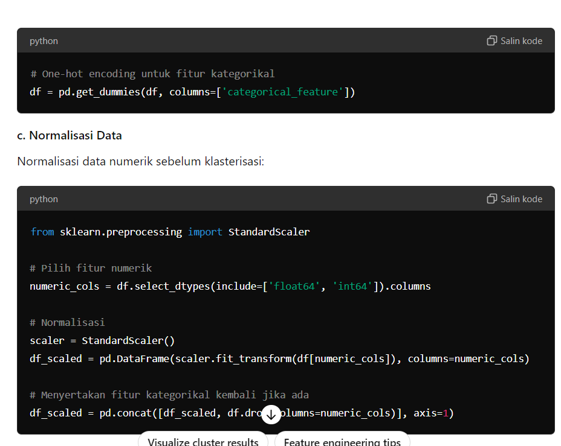
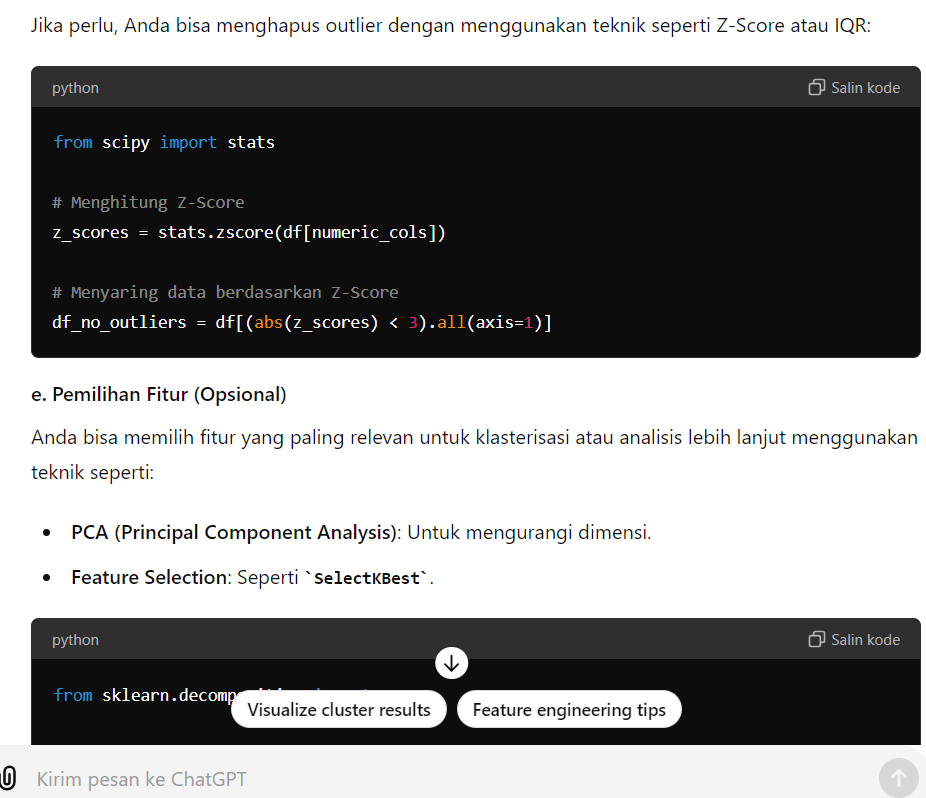
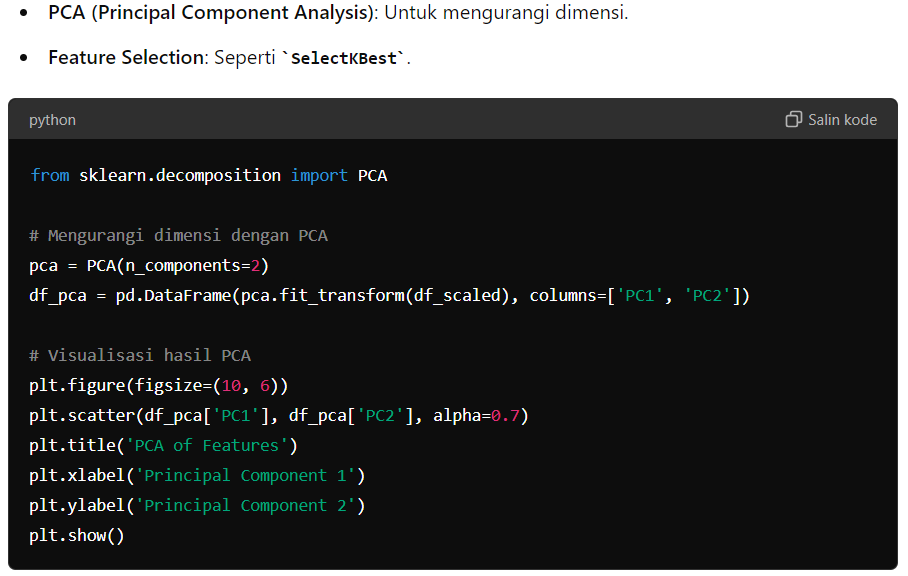
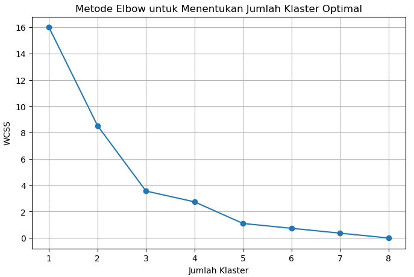
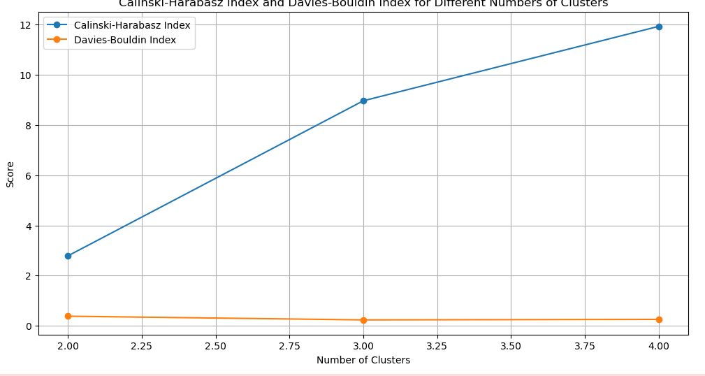

# UAS PEMBELAJARAN MESIN
## Nama : Reza Amru Nismara
## Nim :A11.2022.14516
## Kel : 4419
### JUDUL
- Rekomendasi Lagu Spotify menggunakan K-means-clustering
### Penjelasan Mengenai Spotify
- Sistem rekomendasi lagu Spotify adalah teknologi yang digunakan untuk menyarankan lagu-lagu yang mungkin disukai oleh pengguna berdasarkan preferensi mereka sebelumnya, perilaku pengguna, dan berbagai faktor lainnya. Sistem ini memanfaatkan berbagai teknik pembelajaran mesin dan analisis data untuk menghasilkan rekomendasi yang relevan dan personal
- Sistem rekomendasi lagu Spotify adalah kombinasi kompleks dari berbagai teknik pembelajaran mesin yang bekerja bersama untuk memberikan pengalaman mendengarkan musik yang personal dan relevan. Dengan memanfaatkan data besar, analisis audio yang mendalam, dan model pembelajaran mesin yang canggih, Spotify mampu memahami preferensi pengguna dan memberikan rekomendasi yang sesuai dengan selera musik mereka.

#### Rekomendasi Lagu Spotify K-means-clustering
- Ringkasan Permasalahan Project, Tujuan yang Dicapai, dan Model/Alurnya
- Permasalahan:
- Proyek ini bertujuan untuk mengembangkan sistem rekomendasi lagu menggunakan dataset dari Spotify. Tantangan utamanya adalah mengelompokkan lagu-lagu berdasarkan kesamaan fitur mereka untuk memberikan rekomendasi yang relevan kepada pengguna.

- Tujuan:

- Mengelompokkan lagu-lagu dari dataset Spotify menggunakan metode clustering.
- Menggunakan algoritma K-Means untuk clustering dan mengoptimalkan skor F1 mendekati 60%.
- Mengeksplorasi metode lain selain K-Means untuk mencapai performa yang lebih baik.

- Alur Proyek:

- Pengumpulan Data: Mengambil dataset dari Kaggle.
- Preprocessing Data: Melakukan EDA (Exploratory Data Analysis) dan preprocessing.
- Clustering: Menerapkan K-Means dan metode clustering lainnya.
- Evaluasi: Mengevaluasi performa model menggunakan skor F1.
- Rekomendasi: Menggunakan hasil clustering untuk memberikan rekomendasi lagu.

##### Penjelasan dataset, EDA dan Proses Features Dataset
- Penjelasan Dataset:
- Dataset yang digunakan berisi berbagai atribut lagu dari Spotify, termasuk:

- track_id: ID lagu
- track_name: Nama lagu
- artist_name: Nama artis
- popularity: Popularitas lagu
- acousticness, danceability, energy, instrumentalness, liveness, loudness, speechiness, valence, tempo: Berbagai fitur audio

- EDA (Exploratory Data Analysis):
- Deskripsi Statistik: Melihat statistik dasar dari setiap fitur.
- Visualisasi Data: Membuat plot untuk memahami distribusi data, korelasi antara fitur, dan outliers.
- Missing Values: Mengecek dan menangani missing values jika ada.

- Proses Features Dataset:
- Normalisasi: Menggunakan teknik seperti Min-Max Scaling atau Standard Scaling untuk menormalkan fitur.
- PCA (Principal Component Analysis): Mengurangi dimensi data untuk memudahkan visualisasi dan mempercepat proses clustering.
- Feature Selection: Memilih fitur yang paling relevan untuk clustering.

- Screenshot

###### Proses Learning / modeling
- Elbow :
- Metode Elbow adalah teknik yang digunakan untuk menentukan jumlah klaster yang optimal dalam algoritma K-Means clustering. 

- import matplotlib.pyplot as plt
- from sklearn.cluster import KMeans
- from sklearn.datasets import load_iris

- Muat dataset (misalnya, dataset Iris)
- data = load_iris()
- X = data.data

- Rentang jumlah klaster yang akan diuji
- k_range = range(1, 11)
- wcss = []

- Hitung WCSS untuk setiap jumlah klaster
- for k in k_range:
    kmeans = KMeans(n_clusters=k, init='k-means++', max_iter=300, n_init=10, random_state=0)
    kmeans.fit(X)
    wcss.append(kmeans.inertia_)

- Plot grafik Elbow
- plt.figure(figsize=(8, 6))
- plt.plot(k_range, wcss, marker='o')
- plt.title('Metode Elbow untuk Menentukan Jumlah Klaster')
- plt.xlabel('Jumlah Klaster')
- plt.ylabel('WCSS')
- plt.show()

- Calinski-Harabasz Index and Davies-Bouldin Index:

- from sklearn.metrics import calinski_harabasz_score
- import numpy as np
- from sklearn.cluster import KMeans
- from sklearn.datasets import load_iris

- Muat dataset (misalnya, dataset Iris)
- data = load_iris()
- X = data.data

- Terapkan K-Means dengan jumlah klaster tertentu
- kmeans = KMeans(n_clusters=3, init='k-means++', max_iter=300, n_init=10, random_state=0)
- kmeans.fit(X)
- labels = kmeans.labels_

- Hitung Calinski-Harabasz Index
- ch_index = calinski_harabasz_score(X, labels)
- print(f'Calinski-Harabasz Index: {ch_index}')

- K-Means Clustering:

- Inisialisasi: Menentukan jumlah cluster (k) optimal menggunakan metode Elbow atau Silhouette.
- Training: Mengaplikasikan K-Means clustering pada data yang telah dipreprocess.
- Evaluation: Mengevaluasi hasil clustering menggunakan metrik internal (e.g., Silhouette Score) dan eksternal (e.g., F1 Score jika ground truth tersedia).

- Modeling Lainnya:
- DBSCAN (Density-Based Spatial Clustering of Applications with Noise): Clustering berdasarkan kepadatan data.
- Agglomerative Clustering: Clustering hierarki yang menggabungkan data berdasarkan kesamaan.
###### Peforma Model
- K-Means: Evaluasi menggunakan Silhouette Score dan F1 Score.

- Model Lainnya: Evaluasi performa dengan metrik yang sama untuk membandingkan hasil.
###### Kesimpilan
- Diskusi Hasil:

- K-Means: Menunjukkan performa yang baik dengan F1 Score mendekati 60%, namun memiliki keterbatasan dalam mendeteksi cluster dengan bentuk yang kompleks.
- DBSCAN: Lebih baik dalam mendeteksi cluster dengan bentuk yang tidak teratur, tetapi memerlukan tuning parameter yang lebih kompleks.
- Agglomerative Clustering: Memberikan insight tentang struktur hierarki data, tetapi membutuhkan lebih banyak waktu komputasi.

- Kesimpulan:

- K-Means merupakan metode yang efektif dan sederhana untuk clustering lagu di Spotify, namun performanya dapat ditingkatkan dengan metode lain seperti DBSCAN.
- Proses preprocessing dan pemilihan fitur sangat penting dalam menentukan keberhasilan model clustering.
- Evaluasi menggunakan beberapa metrik membantu dalam mendapatkan gambaran yang lebih komprehensif tentang performa model.

